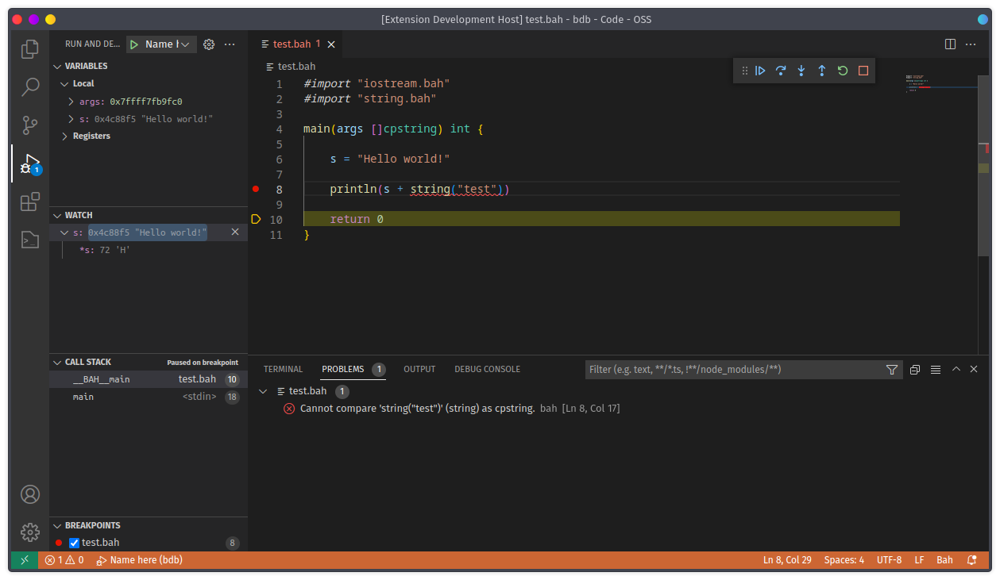
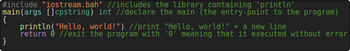
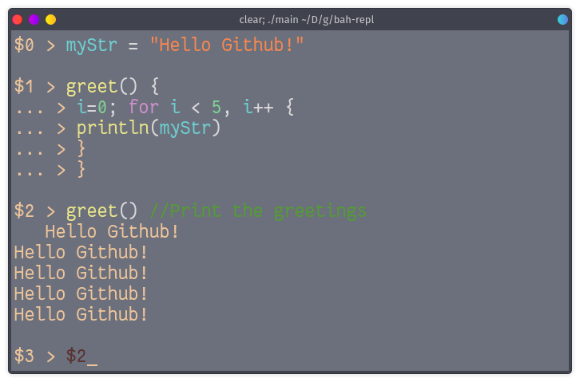

<div align="center">
<p>
    <a href="https://bah-lang.xyz"></a>
    <h1>Bah-lang</h1>
</p>
</div>

## Installation
> Note that Windows and MacOS (darwin) releases may be delayed compared to Linux releases.

To install bah on your machine, get the terminal warmed up 🔥 , stretch your fingers up 🏋‍♂ and paste this 😎:
### Linux
> Note that if you have pacman/apt installed on your system, gcc and such will be automatically installed.
```sh
git clone https://github.com/ithirzty/bah
cd ./bah
sudo ./linux_install.sh
```
If the installation fails for whatever reason, you will need to recompile the Bah compiler
before installing it. Dont worry this is simple, simply run:
```sh
sudo ./linux_compile_install.sh
```

### Windows
**Please make sure that you have [mingw gcc](https://sourceforge.net/projects/mingw/) installed.**

#### For the newbies, **READ CAREFULLY**. More help [HERE](https://bah-lang.xyz/get-started-windows)
1. Install [MinGW](https://sourceforge.net/projects/mingw/).
2. In the MinGW installation manager, select:
   - MinGW Base System: MinGW base,
   - MinGW libraries: mingw32-pthreads-w32 (or pthread equivalent).
3. Click on the 'installation' menu and selct 'apply changes'.
4. Clone this repository (download it).
5. Open an administrator shell (cmd.exe).
6. Execute `windows_install.bah` as administrator.
```bat
git clone https://github.com/ithirzty/bah
cd ./bah
.\windows_install.bat
```
If the installation fails for whatever reason, you will need to recompile the Bah compiler
before installing it. Dont worry this is simple, simply run:
```bat
.\windows_compile_install.bat
```

### MacOS (darwin)
```bat
git clone https://github.com/ithirzty/bah
cd ./bah
.\darwin_install.bat
```
If the installation fails for whatever reason, you will need to recompile the Bah compiler
before installing it. Dont worry this is simple, simply run:
```bat
.\darwin_compile_install.bat
```

> Note: yoy may need to run the following command after install if the version is Bah compiler is out of date `clang -I "/opt/bah/libs/darwin/include/" -L "/opt/bah/libs/darwin/" ./installer/darwin.c -O1 -w -lgc -lpthread -lm -o /opt/bah/bah`
<div align="center">
<a href="https://youtu.be/druJwBluvLc">

</a>
</div>

## More?
Yeah, there is more.
You can also install the Bah extension for VS Code:
<div align="center">
<a href="https://github.com/ithirzty/bah-vscode">

</a>
</div>


## Updating
To update, execute the following:
```sh
./linux_update.sh
```
If the repository is updated, this script will pull the main branch and install everything.

## Usage
Files containing bah code have the `.bah` extenstion.
- To compile your program, use `bah <file> <flags>` (example: `bah main.bah`).
```
Usage of bah:
    -o (string)
        Name of the file to output.
    -c (bool)
        Translate bah file to C instead of compiling it.
    -v (bool)
        Show version of the compiler.
    -l (bool)
        Compile as a library.
    -object (bool)
        Compile as an object.
    -n (bool)
        Disables notices while keeping warnings enabled.
    -d (bool)
        Compile as a dynamic executable. (useful if you are using a library that is only available shared but might reduce portability).
    -target (string)
        Select the target OS for cross compilling (linux, windows, darwin), default: linux.
    -bahDir (string)
        If your Bah directory is not the default one (/opt/bah/).
    -CC (string)
        To change the C compiler used, default: gcc.
    -unsafe (bool)
        Compile without safety checking. This will make for faster executable but if your program crashes, it will show less informations.
    -nobuiltin (bool)
        Does not include the builtin library (be really carefull, your program WILL break).
    -optimize (bool)
        Includes optimized functions
    -rcp (bool)
        Enables RCP (reference counter) instead of the garbage collector. Warning: if you are using self-reference, this will lead to memory leaks!
    -fastrcp (bool)
        Enables RCP without leak detection. It is recommended to test you programs with the -rcp flag to test for leak detection before using this flag.
    -lightGC (bool)
        Enables the really light weight with no dependecy garbage collector. This one is not as complex as the default one, it is though not as robust.
    -nativeMem (bool)
        Disable any memory management. WARNING: this will cause insane memory leaks.
    -fixMe (bool)
        Enables runtime debugging engine, useful for segfaults... Note that your program will be slower and use more memory, this is only a debug option.
    -debug (bool)
        Enables verbose json output.
    -verboseRuntime (bool)
        Enables verbose runtime, a debug mode of the compiled program. (obsolete)
    -verboseCC (bool)
        Enables verbose C compiler output, USE IN LAST RESORT.
```
## Learning
Hello world:



---

<center>

<p>
<a href="https://github.com/ithirzty/bah-repl">Bah REPL</a>, a simple way of learning Bah lang.
</p>
</center>

---


## Why?
Bah is a really fast language with as little bloat as possible. Its simplicity lets you choose your level of abstraction (C like low level <-> Go like high level).

It has been used to create:
- website
    - [bah-lang website](https://bah-lang.xyz)
- compilers
    - [bah compiler](https://github.com/ithirzty/bah)
- interpreters
    - [Bah REPL](https://github.com/ithirzty/bah-repl)
    - [Brainfuck interpreter](https://github.com/ithirzty/bah-brainfuck)
- libraries
    - ~~[Javel](https://github.com/ithirzty/javel)~~ [javel2](https://github.com/ithirzty/javel2), a HTTP server framework written in Bah.
    - [BPM](https://github.com/ithirzty/bpm), the Bah Package Manager.
    - [vbah](https://github.com/ithirzty/vbah), a graphics library.
    - [BahDB](https://github.com/ithirzty/bahdb), a relational database written in Bah.
    - [bah-bmp](https://github.com/ithirzty/bah-bmp), an image edition library.
- and many more.
> You did something awesome in bah? Add it to the list!


### Awesome features
Bah also supports awesome features like:
- **reflection** (single call JSON conversion, function evaluation...),
- **multiple memory management** (GC by default, -lightGC, -nativeMem and -rcp flags),
- **async calls** (execute function call in a new thread),
- **channels, maps, arrays, tuples** (useful builtin data structures),
- **compile-time safety features** (null value checker, static loop iterator...),
- **fixMe** (cry for help when a segfault occurs),
- **optional safe syntax** (let, type!...),
and many other features (generics, optimizations, methods...)

## Imports and includes
When to use `#import` and `#include`?

`#import` isolates the specified file where `#include` will simply include it.<br>
If the file to import needs the file that imports it, then importing it will fail.<br>
For example, `a.bah` imports `b.bah` but `b.bah` needs a global variable defined in `a.bah`.
Then, using `#import` instead of `#include` will fail.<br>
On the other hand, `a.bah` needs `iostream.bah`. Iostream does not depend on `a.bah`.
You can then import it.

More generally, if `#import` fail, use `#include` that cannot fail.<br>
Note that using import reduce compilation time because of its use of the cache.

## How does it work?
Information on how a Bah compiler should operate can be found [here (outdated)](how.md).
