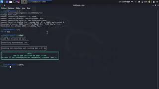
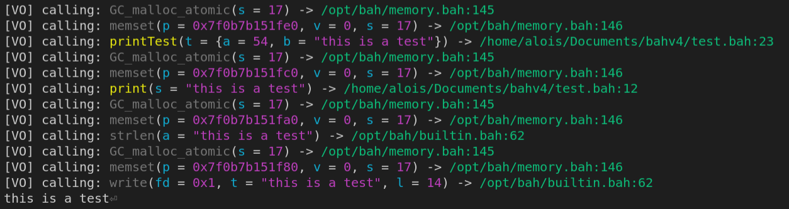

# [Bah-lang](https://bah-lang.xyz)

## Installation
> Note that Windows and MacOS (darwin) releases may be delayed compared to Linux releases.

To install bah on your machine, get the terminal warmed up 🔥 , stretch your fingers up 🏋‍♂ and paste this 😎:
### Linux
```sh
git clone https://github.com/ithirzty/bah
cd ./bah
sudo ./linux_install.sh
```
If the installation fails for whatever reason, you will need to recompile the Bah compiler
before installing it. Dont worry this is simple, simply run:
```sh
sudo ./linux_compile_install.sh
```

### Windows
**Please make sure that you have [mingw gcc](https://sourceforge.net/projects/mingw/) installed.**
```bat
git clone https://github.com/ithirzty/bah
cd ./bah
.\windows_install.bat
```
If the installation fails for whatever reason, you will need to recompile the Bah compiler
before installing it. Dont worry this is simple, simply run:
```bat
.\windows_compile_install.bat
```

### MacOS (darwin)
```bat
git clone https://github.com/ithirzty/bah
cd ./bah
.\darwin_install.bat
```
If the installation fails for whatever reason, you will need to recompile the Bah compiler
before installing it. Dont worry this is simple, simply run:
```bat
.\darwin_compile_install.bat
```


[](https://youtu.be/druJwBluvLc)

## Updating
To update, execute the following:
```sh
./linux_update.sh
```
If the repository is updated, this script will pull the main branch and install everything.

## Usage
Files containing bah code have the `.bah` extenstion.
- To compile your program, use `bah myFile.bah`.
- To translate your program as C code, use `bah myFile.bah -c`.
- To set an output name to your program, use the `bah myFile.bah -o myCompiledProgram`.
- To get the current installed version, use `bah -v`.
- To compile as a static library, use `bah myFile.bah -l`.
- To compile your program as a dynamically linked program, use `bah myFile.bah -d`.
- To compile your program using the reference counter instead of the garbage collector, use `bah myFile.bah -rcp`. **Still in progress, may leak in certain cases.**
- To compile your program using the FASTER reference counter instead of the garbage collector, use `bah myFile.bah -fastrcp`. **This reference counter will not check for memory leaks.**
- To compile your program using builtin debugging tools, use `bah myFile.bah -verboseRuntime`. **This will outputs a lot of data.**

### Hello, world!
```c
#include "iostream.bah" //includes the library containing 'println'
main(args []cpstring) int //declare the main (the entry-point to the program)
{
    println("Hello, world!") //print "Hello, world!" + a new line
    return 0 //exit the program with '0' meaning that it executed without error
}
```

## Why?
Bah is a really fast language that is low level enough for most cases while being really simple.
As well as being easy to learn, you can create 
- website
    - [bah-lang website](https://bah-lang.xyz)
- compilers
    - [bah compiler](https://github.com/ithirzty/bah)
- interpreters
    - [Brainfuck interpreter](https://github.com/ithirzty/bah-brainfuck)
- web apps
    - [bah-lang doc](https://github.com/ithirzty/bah-website)
- libraries
    - [BahDB](https://github.com/ithirzty/bahdb), a relational database written in Bah.
    - [Javel](https://github.com/ithirzty/javel), a HTTP server framework written in Bah.
    - [BPM](https://github.com/ithirzty/bpm), the Bah Package Manager.
    - [vbah](https://github.com/ithirzty/vbah), a graphics library.
    - [bah-bmp](https://github.com/ithirzty/bah-bmp), an image edition library.
    - [bah-cjson](https://github.com/ithirzty/bah-cjson), a chuncked json library.
- and many more.
> You did something awesome in bah? Add it to the list!


### Awesome features
Bah also supports awesome features like:
- **reflection** (approach similar to Go, enabling easy JSON marshalling),
- **reference counting** (-rcp or -fastrcp flags),
- **async calls** (execute function call in a new thread),
- **channels** (thread safe pipes to send data),
- **runtime evaluation** (for evaluating code at runtime `eval.bah`),
- **embedded debugger** (for setting breakpoints),
- **verbose runtime** (an included tool for debugging)...



This enables you to do things that would be impossible in C
such as scanning JSON content to a variable (event structs and arrays), and marshalling vars to JSON.
All of that with a single function call!

Bah also has a garbage collector AND a reference counter. You can choose the one that fits your needs at compile time!

### [List of most important features](features.md)


## Imports and includes
When to use `#import` and `#include`?

`#import` isolates the specified file where `#include` will simply include it.<br>
If the file to import needs the file that imports it, then importing it will fail.<br>
For example, `a.bah` imports `b.bah` but `b.bah` needs a global variable defined in `a.bah`.
Then, using `#import` instead of `#include` will fail.<br>
On the other hand, `a.bah` needs `iostream.bah`. Iostream does not depend on `a.bah`.
You can then import it.

More generally, if `#import` fail, use `#include` that cannot fail.<br>
Note that using import reduce compilation time because of its use of the cache.

## How does it work?
Information on how a Bah compiler should operate can be found [here](how.md)
