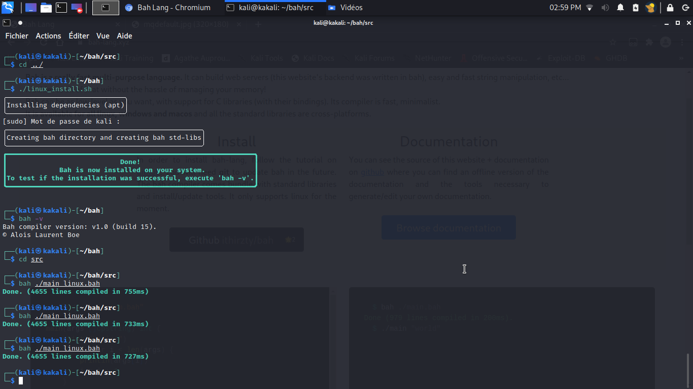

# [Bah-lang](https://bah-lang.xyz)

## Installation
> Note that Windows and MacOS (darwin) releases may be delayed compared to Linux releases.

To install bah on your machine, get the terminal warmed up 🔥 , stretch your fingers up 🏋‍♂ and paste this 😎:
### Linux
```sh
git clone https://github.com/ithirzty/bah
cd ./bah
sudo ./linux_install.sh
```
If the installation fails for whatever reason, you will need to recompile the Bah compiler
befor installing it. Dont worry this is simple, simply run:
```sh
sudo ./linux_compile_install.sh
```

### Windows
**Please make sure that you have [mingw gcc](https://sourceforge.net/projects/mingw/) installed.**
```bat
git clone https://github.com/ithirzty/bah
cd ./bah
.\windows_install.bat
```
If the installation fails for whatever reason, you will need to recompile the Bah compiler
befor installing it. Dont worry this is simple, simply run:
```bat
.\windows_compile_install.bat
```

### MacOS (darwin)
```bat
git clone https://github.com/ithirzty/bah
cd ./bah
.\darwin_install.bat
```
If the installation fails for whatever reason, you will need to recompile the Bah compiler
befor installing it. Dont worry this is simple, simply run:
```bat
.\darwin_compile_install.bat
```


[](https://youtu.be/druJwBluvLc)

## Updating
To update, execute the following:
```sh
./linux_update.sh
```
If the repository is updated, this script will pull the main branch and install everything.

## Usage
Files containing bah code have the `.bah` extenstion.
- To compile your program, use `bah myFile.bah`.
- To translate your program as C code, use `bah myFile.bah -c`.
- To set an output name to your program, use the `bah myFile.bah -o myCompiledProgram`.
- To get the current installed version, use `bah -v`.
- To compile as a static library, use `bah myFile.bah -l`.

### Hello, world!
```c
#include "iostream.bah" //includes the library containing 'println'
main(args []cpstring) int //declare the main (the entry-point to the program)
{
    println("Hello, world!") //print "Hello, world!" + a new line
    return 0 //exit the program with '0' meaning that it executed without error
}
```

## Why?
Bah is a really fast language that is low level enough for most cases while being really simple.
As well as being easy to learn, you can create 
- website (such as the [bah-lang](https://bah-lang.xyz) website),
- compilers (the bah compiler is written in bah),
- interpreters (such as the [Brainfuck interpreter](https://github.com/ithirzty/bah-brainfuck)),
- web apps (the documentation of bah is wrapped up in a [web app](https://github.com/ithirzty/bah-website)),
- and many more.
> You did something awesome in bah? Add it to the list!

## Extras
Here is how fast bah v1.0 (build 15) compiles itself on a ThinkPad x220 (a 16 years old machine)

