# List of all features
Here is a list of most of the features supported by the Bah compiler.

| Name | Description | Support | Example |
| ---- | ----------- | ------- | ------- |
| Keywords | These are used for modifying code behavior at compile time, such as #include #define #cLib #linux... | All keywords are fully supported except for #macro. | 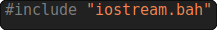 |
| Conditional statements | Used for changing code behavior at runtime, such as if/else statements and for loops with continue and break. | Fully supported. | 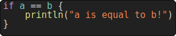 |
| Declarations | Variable, constant, function, type and function binding declaration.  -> A type declared will be handled by the compiler as a fully new type, without any link to the old one.  -> A variable can be declared with a type without any value and defined with a value without precising its type.  -> Function binding and types are defined using the #define keyword. | Fully supported. | 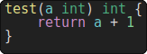 |
| Operations | Using an operation between two values as a value.  -> This includes string operations and struct operation.  -> Defining an operation for a struct type can be made by defining its methods named `.add() .mult() .div() .sub()`. | Fully supported except for bitwise operations (this will come soon). | 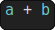 |
| Casting | Casting a variable with a new type.  -> Inline casting with `<type>value` if the type only contains alphanumerical characters.  -> Declaring a variable with a specific type independently from its value with `var type = value` | Fully supported except if inline cast contains non alphanumerical character such as a '*' | 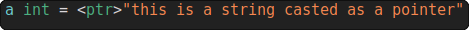 |
| Structures |  -> Declaring a structure using the `struct <name> {<fields>}` where there is one field by line.  ->  Methods are declared as usual functions inside the fields.  -> A default value can be set for every field with the '=' operator followed by a constant value.  -> Here is a field declaration syntax `field: type = defaultValue` with an optional default value.  -> A new variable with a struct type can be allocated on the stack with `a = myStruct{}` or on the heap, returnning a pointer to the struct as `a = new myStruct`. <bt>-> Making a structure inline using `myStruct{a, b}` or `myStruct{fieldA: a fieldB: b}`. -> Accessing a variable's field is done by separating fields with a '.'. | Fully supported. | 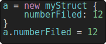 |
| Arrays | Arrays are dynamic lists of elements.  -> Appending to an array will automatically grow the array if needed. It can be done by setting the element with an index equal to the array's length. If attempting to append an element larger than the length of the array, it will lead to undefined behavior.  -> An array var points to a location in the stack.  -> The length of an array can be returned using the `len(array) int` function.  -> When declaring an array, you can use brackets to fill its initial values separated by a coma.  -> The indexing of arrays starts at 0. | Fully supported. | 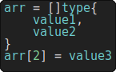 |
| Booleans | A boolean is a datatype that is either true or false. -> It can be defined as a condition `a operator b` etc... using the operators `==`, `!=`, `>`, `<`, `>=`, `<=` and combinned using the logic operators `\|\|` (or) and `&&` (and).  -> You can also check if a value iis contained inside an array with the `in` operator `<value> in <array>`  -> It can also be defined with the keywords `true` and `false`. | Fully supported. | 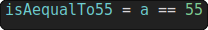 |
| Pointers | A pointer is a reference to a memory block.  -> A pointer to a var can be made using `&a`.  -> Accessing the content of a pointer can be made using `*a` | Supported with undefined behaviors on structures fields. | 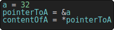 |
| Reflection | When including the "reflect.bah" library, you can get a reflection of a var as a function argument by declaring a function argument with the type `reflectElement`.  -> A reflection of a variable is used for getting informations about its type at runtime. | Supported with some occasional bugs. | 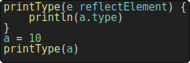 |
| Function calls | A function can be called and used as a value as following: `functionName(<args>)`.  -> The args needs to be separated by comas where every argument is a value.  -> The number of arguments passed to the function must be equal to the number of argument when declaring the function. | Fully supported. | 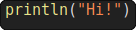 |
| Function pointers | A variable can be declared as a function pointer by defining its type as `function(args)`.  -> You can then point to a function with a function pointer using `functionPointer = functionName`. | Fully supported. | 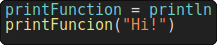 |
| Function bindings | You can bind a function from a C library using `#define! functionName(<args>) returnType`.  -> If you want to pre-declare a function, you can use `#define functionName(<args>) returnType`. | Fully supported. | 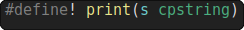 |
| C library | You can link the program with a C library using the `#cLib` keyword followed by libraries to link inside double quotes. | Fully supported. | 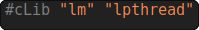 |
| Constant | A constant can be declared using a constant value using the `const` keyword.  -> You cannot change the value of a constant. | Supported with undefined behaviors if reusing const name in other scopes. | 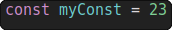 |
| Return | When declaring a function, you can make it return a value while stopping its execution using the `return` keyword followed by a value. | Fully suported. | 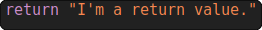 |
| Async | Make a function call in a new thread. | Supported, still early, may contain memory corruption. | 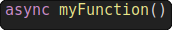 |
| Channels | Make a thread safe channel. | Supported, still early, may have edge cases. | 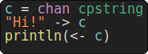 |
| Evaluation | Evaluate code at runtime.  -> Use `#eval myFunction` to make a function evaluable.  -> Evaluate a function using `eval(code, result)`, `result = evalRaw(code)` or `evalCall(functionName, arguments)` (where arguments are an array of pointers). | Supported, still early, may have edge cases. | 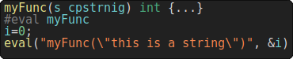 |

If **you find any bug** with the features listed above or you feel a **feature should be detailed in the table above**, you can open an issue on the [repository](https://github.com/ithirzty/bah) or by [contacting me](mailto:alois@alois.xyz).